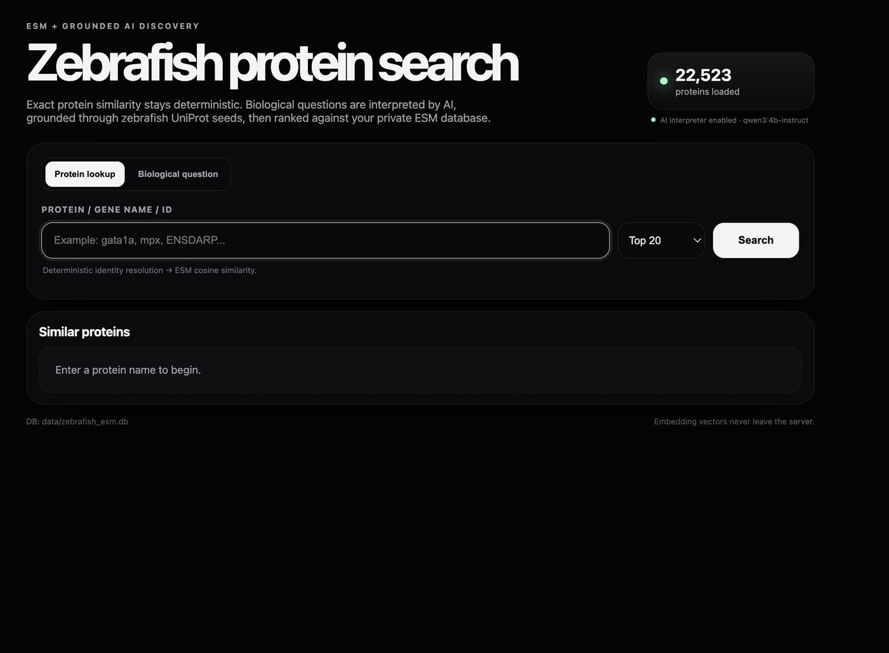
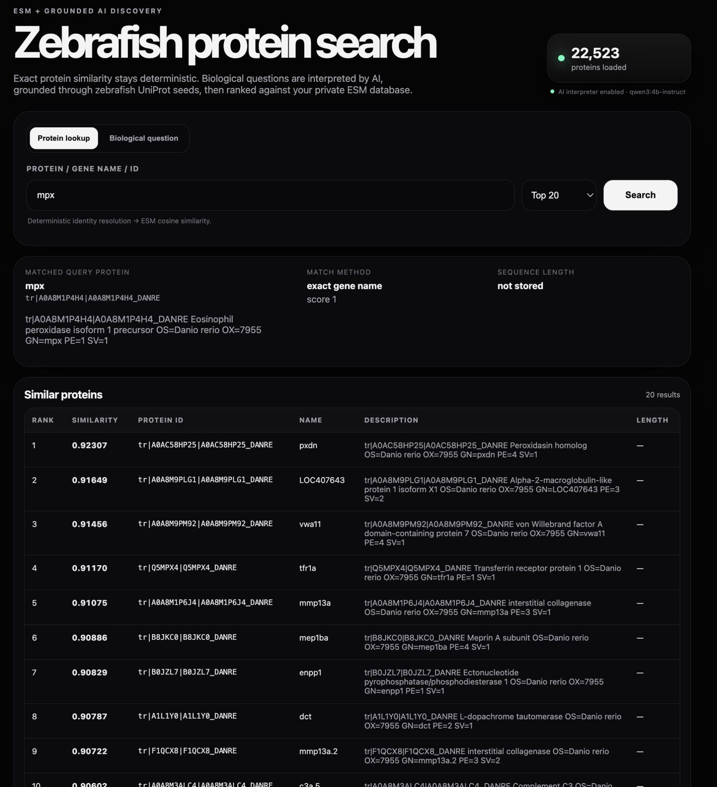
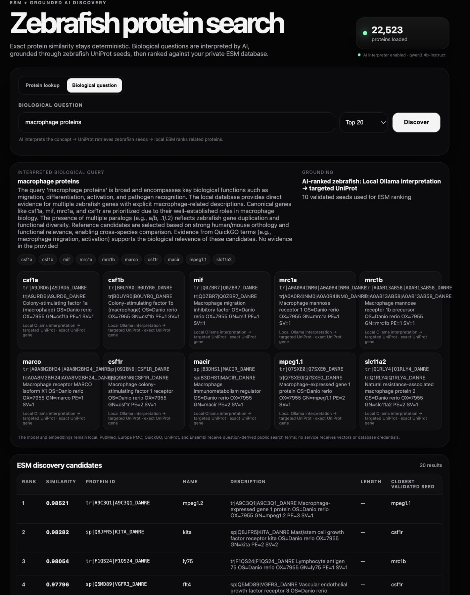

# Zebrafish Protein Search

**ESM + grounded AI discovery for the *Danio rerio* proteome.**

A local scientific search system that combines whole-proteome ESM embeddings, deterministic protein lookup, a choice of Gemini or local Qwen reasoning, biological search tools, and exact zebrafish identifier validation.

The current private search database contains **22,523 zebrafish proteins**, represented by **2,560-dimensional ESMC 6B embeddings** and searched locally by cosine similarity.



## What it does

The dashboard has two complementary search modes.

### 1. Deterministic protein lookup

Enter an exact gene symbol, UniProt accession, or protein identifier. The query is resolved against the local zebrafish database and used directly as an ESM seed. No LLM is required.

```text
protein / gene / ID
        ↓
exact local identity resolution
        ↓
local ESM cosine similarity
        ↓
ranked zebrafish proteins
```

Example: `mpx`



### 2. Biological-question discovery

Ask a biological question such as:

```text
Which proteins mark zebrafish macrophages?
Which proteins are involved in canonical Wnt signalling in zebrafish?
Which genes regulate zebrafish erythropoiesis?
Which proteins are associated with fin regeneration?
```

The AI layer interprets the question and proposes biologically relevant candidates. Candidate identifiers are then resolved against zebrafish-specific resources and the local database before they are allowed to seed the ESM search.

```text
biological question
        ↓
Gemini + grounded Google Search
or
Qwen3 4B + local/scientific retrieval
        ↓
biological candidate selection
        ↓
exact zebrafish validation
        ↓
validated seed proteins
        ↓
local ESM similarity search
        ↓
ranked discovery candidates
```



## Why the architecture is split

The language model is used for **biological interpretation and ranking**, not as the authority for protein identity.

A fluent answer can still contain the wrong zebrafish symbol, a mammalian-style gene name, or a biologically related protein that is not a good answer to the question. The system therefore separates responsibilities:

- **Gemini + grounded Google Search:** hosted biological research and candidate selection
- **Qwen3 4B + PubMed / Europe PMC / QuickGO / local metadata:** local-model biological interpretation with scientific evidence
- **UniProt / Ensembl / local DB:** identifier resolution and validation
- **ESMC 6B embeddings:** protein-representation similarity and candidate expansion

Only proteins that resolve to the local *Danio rerio* search space can seed the final ESM search.

## Protein embeddings

The embedding dataset was generated with the pretrained **EvolutionaryScale ESMC 6B** model through the Forge API.

Current local dataset:

- **22,523** zebrafish proteins
- **2,560-dimensional** mean-pooled protein embeddings
- SQLite protein metadata
- NumPy cosine-similarity search

ESMC is used to generate the reusable embedding dataset. Normal dashboard searches operate on the local vectors and do not require a new ESM inference call.

## AI provider options

The dashboard supports two biological-discovery providers. Set `AI_PROVIDER=gemini` for **Gemini with grounded Google Search**, or `AI_PROVIDER=ollama` for **local `qwen3:4b-instruct` through Ollama**.

The Gemini path uses grounded search to research the biological question, converts that evidence into structured candidates, and passes those candidates through the same zebrafish-specific identifier validation before ESM ranking.

The local Qwen path specializes the unchanged model at the system level through zebrafish-specific context, retrieval, scientific tools, and deterministic validation. Its integrations include:

- local zebrafish protein metadata
- PubMed E-utilities
- Europe PMC
- QuickGO / Gene Ontology
- UniProt REST
- Ensembl REST
- local ESM similarity search

The embedding database always remains local. With Qwen, model inference also remains local and public biological services receive only query-derived terms. With Gemini, the biological question and grounded-search request are sent to Gemini; raw embedding vectors and local database credentials are not sent to any provider.

## Benchmarking

The project is benchmarked at the **system level**, not only by whether the LLM returns a syntactically valid gene name.

The results below evaluate the local Qwen path only. Gemini remains a supported runtime option; a separate Gemini grounded-search and tools benchmark has not yet been reported.

The most important diagnostic is whether the ranked validated seed list recovers predefined **canonical zebrafish reference genes**. Canonical overlap is useful for comparison, but it is **not treated as biological accuracy** because the reference lists are intentionally non-exhaustive.

### Hard-25 development stress test

A 25-question challenge set was selected from the first 50 paired benchmark cases to concentrate on difficult failures: cases where the earlier augmented system lost a canonical answer, cases where neither system found one, plus a known macrophage rescue control.

Because this set was deliberately selected for difficulty, **it is a development stress test and not an unbiased estimate of general performance**.

| Architecture | Any canonical hit | Mean canonical recall | Hit@1 | MRR | Unresolved proposed IDs | Median latency |
|---|---:|---:|---:|---:|---:|---:|
| Base Qwen3 4B | 76% | 31% | 60% | 0.673 | 45.7% | 21.6 s |
| **Qwen → scientific tools → Qwen rerank** | **80%** | **32%** | **60%** | **0.673** | **21.5%** | 111.7 s |
| Local metadata → Qwen | 12% | 4% | 0% | 0.047 | **1.7%** | 25.2 s |

The key result is that **reason-first tool augmentation preserved roughly the same canonical ranking performance as the base model while substantially reducing invalid/unresolvable zebrafish identifiers**. Local lexical context alone produced very clean identifiers but strongly degraded biological ranking on this difficult set.

The benchmark records:

- canonical hit / recall / Hit@1 / Hit@3 / Hit@5 / MRR
- proposed and unresolved genes
- deterministically validated seeds
- raw model outputs
- retrieval provenance and errors
- ESM neighbours
- latency
- model, prompt, database, runner, and dataset hashes

See the benchmark runner and methodology files in the repository for the exact experiment definition. Follow-up inference-time reasoning experiments are kept separate until complete; unfinished results are not reported here.

## Benchmark reporting policy

For reproducibility, benchmark results should be tied to a frozen:

- question set
- model tag and inference settings
- prompt / architecture version
- code commit
- local database hash
- evaluation script
- raw result artifact

Development sets, selected hard cases, and final held-out evaluations should be labelled separately. Architecture changes are not tuned against a held-out final benchmark after it has been opened.

## Installation

```bash
python3 -m venv .venv
source .venv/bin/activate
pip install -r requirements.txt
cp config.example .env
```

For local Qwen through Ollama:

```text
AI_PROVIDER=ollama
OLLAMA_MODEL=qwen3:4b-instruct
OLLAMA_URL=http://127.0.0.1:11434
```

For Gemini:

```text
AI_PROVIDER=gemini
GEMINI_API_KEY=your_key_here
GEMINI_MODEL=gemini-2.5-flash-lite
```

Optional `NCBI_EMAIL` and `NCBI_API_KEY` values are supported for PubMed E-utilities.

## Run locally

On macOS:

```bash
./start_dashboard.command
```

The launcher normally opens:

```text
http://127.0.0.1:8000
```

and falls back to port `3000` if required.

Or start directly:

```bash
python app.py --db data/zebrafish_esm.db --host 127.0.0.1 --port 8000
```

## Build the private database

```bash
python build_database.py \
  --embeddings /path/to/embeddings.npy \
  --metadata /path/to/metadata.csv \
  --id-column protein_id \
  --name-column gene_name \
  --description-column description \
  --out-db data/zebrafish_esm.db
```

The embedding matrix and private search database are intentionally not committed to the public repository.

## Tests

```bash
python -m unittest discover -s tests -v
python -m py_compile app.py build_database.py
```

Live integrations that require the private embedding database, local Ollama, or external biological services are kept out of public CI where appropriate.

## Limitations

- ESM similarity is a discovery signal, not proof of shared function, pathway membership, interaction, or homology.
- A valid zebrafish identifier does not by itself prove biological relevance.
- Canonical benchmark lists are diagnostic examples, not exhaustive ground truth.
- LLM ranking can still be incomplete or wrong even when retrieval and validation succeed.
- Public retrieval quality varies with query wording and source coverage.
- Mean-pooled ESM embeddings and brute-force NumPy similarity are practical baselines rather than final optimized retrieval infrastructure.

## Project goal

This project asks a practical systems question:

> **How far can a small local open-weight model be specialized for a scientific workflow without changing its weights?**

The approach combines protein foundation-model representations, a private species-specific search space, local LLM inference, authoritative biological services, deterministic validation, and controlled benchmarking into one usable zebrafish discovery workflow.
